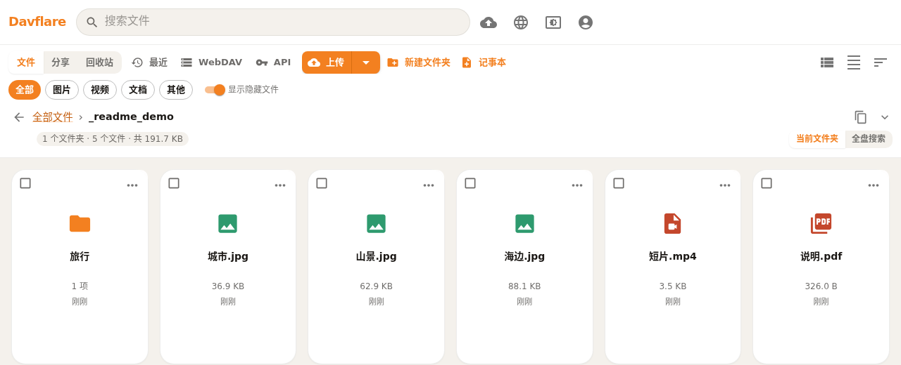
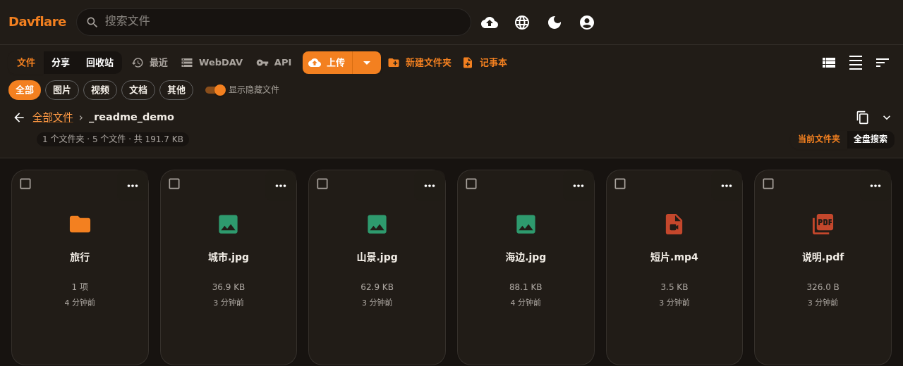
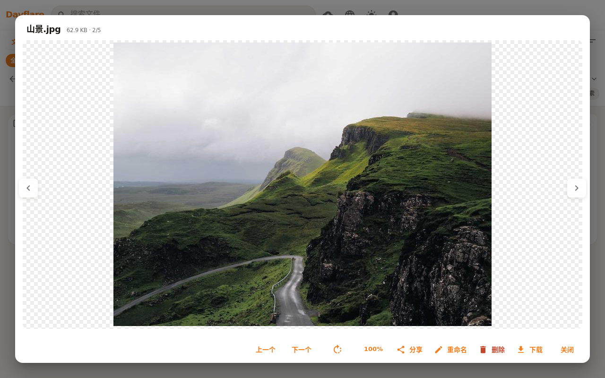

# Davflare

[English](README.md) | [中文](README.zh-CN.md)

 · [部署说明](docs/deploy.zh-CN.md)

基于 **Cloudflare Pages**（API 走 Pages Functions）的 R2 网盘 —— 免费 10 GB 存储、每天 10 万次调用。[R2 定价](https://developers.cloudflare.com/r2/platform/pricing/)

> **这是 Pages，不是 Workers。** 本仓库在 `wrangler.toml` 里配置了 `pages_build_output_dir`，没有 Worker `main`。请**不要**用 [Workers 一键部署按钮](https://deploy.workers.cloudflare.com/) 或 `wrangler deploy`——那会去找 Worker 入口，并报 «entry point not configured / entry point 没有配置」。

## 截图

网格浅色：

网格深色：

图片预览：

分享（有效期 + 提取码）：

## 功能

- 网页端分片上传、文件夹、搜索、拖放，以及图片 / 视频 / PDF 缩略图
- 分享链接（限时或永久）、提取码、文件夹 zip，以及零脚本落地页
- 回收站，保留天数可配（`TRASH_RETENTION_DAYS`）
- WebDAV Class 1/2，路径 `/webdav`（可关闭，不影响网页端）
- API Key 支持脚本上传 / 下载 / 同步，远程 MCP 在 `/mcp`（25 个工具）
- 静态站点与图床走单独域名（`SITES_HOST`）
- 拥有者设置页五个持久化功能开关
- `davflare-cli`、可选 Chrome MV3 扩展，以及 R2 上的 Agent 目录约定
- 中 / 英界面

## 快速开始

1. 打开 [Workers & Pages → Create](https://dash.cloudflare.com/?to=/:account/workers-and-pages/create) → **Pages** → **Connect to Git**，选择本仓库（需要已开通 R2、并绑定支付方式的 Cloudflare 账号）。
2. 框架预设选 **None**，构建命令 `npm run build`，输出目录 `build`（也可直接用 `wrangler.toml` 里的 `pages_build_output_dir`）。
3. 将 R2 bucket 绑定到 `BUCKET`，设置 `WEBDAV_USERNAME` 和 `WEBDAV_PASSWORD`，然后重新部署。
4. 可选：`WEBDAV_PUBLIC_READ=1`、`TRASH_RETENTION_DAYS`（默认 `30`，`-1` 关闭）；公开站点/图床请绑 `sites.<你的域>` 并设 `SITES_HOST=sites.<你的域>`。
5. 可选：给网盘界面绑自定义域名。

完整 Pages / Wrangler 步骤与五个功能开关见 [docs/deploy.zh-CN.md](docs/deploy.zh-CN.md)。

## 文档

| 主题 | 链接 |
| --- | --- |
| 部署、环境变量、功能开关、部署后 `#/setup` 检查清单；MCP 试玩台 `#/mcp` | [docs/deploy.zh-CN.md](docs/deploy.zh-CN.md) · [docs/API.zh-CN.md](docs/API.zh-CN.md) |
| WebDAV 客户端与限制 | [docs/webdav.zh-CN.md](docs/webdav.zh-CN.md) |
| 开放接口与 MCP（含对话分享 / 目录打 zip 示例） | [docs/API.zh-CN.md](docs/API.zh-CN.md) |
| 静态站点与图床 | [docs/sites.zh-CN.md](docs/sites.zh-CN.md) |
| Agent 目录（`pull` / `push`） | [docs/agents.zh-CN.md](docs/agents.zh-CN.md) |
| 命令行（`davflare-cli`） | [cli/README.md](cli/README.md) |
| Chrome 扩展（安装 + 书签） | [extension/README.zh-CN.md](extension/README.zh-CN.md) |
| 书签可移植性 | [docs/bookmarks-portability.zh-CN.md](docs/bookmarks-portability.zh-CN.md) |
| 测试 | [TESTING.md](TESTING.md) · [TEST_CASES.md](TEST_CASES.md) |

## 致谢

- [longern/FlareDrive](https://github.com/longern/FlareDrive) by [longern](https://github.com/longern) —— 最初的 fork 来源；本项目此后已全面重写。内部对象前缀仍为 `_$flaredrive$/`。
- [r2-webdav](https://github.com/abersheeran/r2-webdav) by [abersheeran](https://github.com/abersheeran) —— WebDAV 实现。
- [HamHome](https://github.com/bingoYB/ham_home) by [bingoYB](https://github.com/bingoYB) —— 书签库交互参考，感谢开源。

## 许可证

[MIT](./LICENSE)
